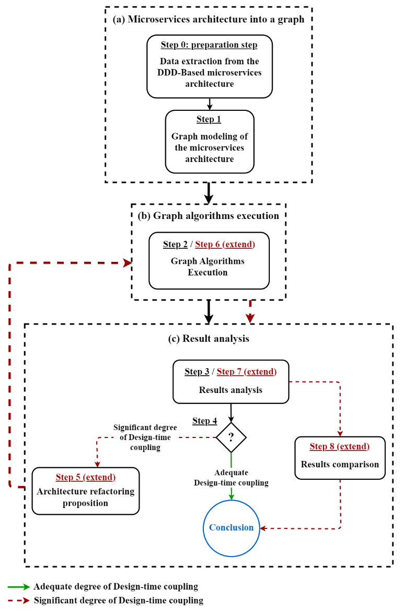

# Using Graph Theory for Assessing Domain-Driven Design-based Microservices Architectures.

This repository offers supplementary information to assist in the research presented in the paper titled "_Using Graph Theory for Assessing Domain-Driven Design-based Microservices Architectures_". It contains technical specifications and findings related to implementing the proposed approach on three microservices projects based on DDD principles.

## Table of Content

* [**Methodology**](https://github.com/FrHassan/Assessing-DDD-based-Microservices-Architectures#Methodology)
* [**Microservices Projects**](https://github.com/FrHassan/Assessing-DDD-based-Microservices-Architectures#Microservices-Projects)  
* [**Project Analysis**](https://github.com/FrHassan/Assessing-DDD-based-Microservices-Architectures#Project-Analysis)  
   - [**Platform and Tools**](https://github.com/FrHassan/Assessing-DDD-based-Microservices-Architectures#Platform-and-Tools)  
   - [**Application of the Methodology**](https://github.com/FrHassan/Assessing-DDD-based-Microservices-Architectures#Application-of-the-Methodology)  
* [**References**](https://github.com/FrHassan/Assessing-DDD-based-Microservices-Architectures#References)

## Methodology

The proposed methodology for evaluating Design-Time coupling in Domain-Driven Design-based microservices architectures as outlined in the paper, is as follows:

 

## Microservices-Projects

The table below showcases the four microservices projects to which the methodology was applied. The hyperlink in the "_Results_" column offers detailed outcomes related to the methodology's application to each microservice project.

| Application name | Reference (Link) | Size | Languages | Known patterns | Graph analysis (Link) | Comment |
| :---             |            :---:            | :---:|   :---:   |     :---:      |        :---:     | :---    |
| Food to Go (FTGO) | [**Ref:** FTGO](https://github.com/microservices-patterns/ftgo-application) | 14 | Java | Multiple microservices patterns | [**FTGO**](https://github.com/FrHassan/Assessing-DDD-based-Microservices-Architectures/tree/main/Microservices-Projects/Food%20to%20Go%20(FTGO)) | An application for restaurant management |
| Pitstop - Garage Management System | [**Ref:** Pitstop](https://github.com/EdwinVW/pitstop) | 8 | C Sharp | CQRS, Event Sourcing | [**Pitstop**](https://github.com/FrHassan/Assessing-DDD-based-Microservices-Architectures/tree/main/Microservices-Projects/Pitstop%20-%20Garage%20Management%20System) | An application for a Garage Management |
| Drone Delivery | [**Ref:** Drone Delivery](https://learn.microsoft.com/fr-fr/azure/architecture/microservices/model/microservice-boundaries) | 10 | .NET and ASP.NET Core |  --  | [**Drone Delivery**](https://github.com/FrHassan/Assessing-DDD-based-Microservices-Architectures/tree/main/Microservices-Projects/Drone%20Delivery) | An application dedicated for managing drone delivery |

## Project Analysis
### Platform and Tools

The main utilized tool to apply the methodology is Neo4j [[2]](https://neo4j.com/), which is an open source graph database management system,

Neo4j offers three main tools to perform graph manipulate graphs: 

* **Neo4j Browser [[3]](https://neo4j.com/developer/neo4j-browser/):** A tool to interact and manipulate graphs. 
* **Neo4j Bloom [[4]](https://neo4j.com/product/bloom/):** A tool to interact visually with the graph.
* **Neo4j NEuler [[5]](https://neo4j.com/developer/graph-data-science/neuler-no-code-graph-algorithms/):** A playground to execute graph algorithms.

### Application of the Methodology

To apply the methodology, we kindly request that you adhere to the provided following instructions:

**1.** Install _Neo4j Desktop_ following the instructions mentioned in [[6]](https://neo4j.com/docs/desktop-manual/current/installation/download-installation/).  
**2.** Use _Neo4j Desktop_ to create a new graph database.  

 

**3.** Under the database "_Plugins_" section, install "_APOC_" and "_Graph Data Science Library_". 
   - _Awesome Procedures On Cypher (APOC)_ [[7]](https://neo4j.com/labs/apoc/) provide useful_ Cypher_ functionalities that help manipulating the graph. 
   - _Graph Data Science Library_ [[8]](https://neo4j.com/docs/graph-data-science/current/) facilitate the execution of the available Neo4j graph algorithms.

 

**4.** Click on the "_Start_" button to run the database.  
   - Whenever the database is operational, Neo4j indicates an active state with a green color.

 

 

 

**5.** Under the "_Open_" list, open _Neo4j Browser_.  
**6.** Create the microservices architecture associated graph using the "_Cypher_"  [[9]](https://neo4j.com/docs/cypher-manual/current/clauses/create/) (You can take inspiration from the code escorted to each existing project in this repository).
   - Now, the created graph could be manipulated _Cypher Query Language_ [[10]](https://neo4j.com/developer/cypher/).  

 

 

**7.** Under the "_Graph Apps_" section, open "Graph Data Science Playground" aka _Neo4j NEuler_.  
   - In case _NEuler_ is absent from the list, you can install it using this url:: [https://neo.jfrog.io/neo/api/npm/npm/neuler](https://neo.jfrog.io/neo/api/npm/npm/neuler)
   - Copy the url and click on "Install".

 

**8.** With _NEuler_, you have the ability to utilize all the graph algorithms that are currently at your disposal.
   - Ensure that you activate the "Store result?" checkbox and make a note of the "Write Property" option as it will be utilized later to save the acquired outcomes.
   - The official documentation provides comprehensive information on all the Neo4j graph algorithms that are available [[11]](https://neo4j.com/docs/graph-data-science/current/algorithms/).

 

 

 

**9)** When accessing _Neo4j Browser_, employ the _Cypher_ match query [[12]](https://neo4j.com/docs/cypher-manual/4.4/clauses/match/) to retrieve the desired results. Following that, you have the option to export the results in a format of your choice, typically CSV.

 

**10)** Using the (.csv) file, you have the option to utilize a suitable tool in order to produce visual representations of your architectural data. 
   - In our case, we use _Microsoft Power BI Desktop_ [[13]](https://www.microsoft.com/fr-fr/download/details.aspx?id=58494) to generate our charts.
   - Example of a chart: [Food to Go (FTGO) - Degree analysis](https://github.com/FrHassan/Assessing-DDD-based-Microservices-Architectures/blob/main/Microservices-Projects/Food%20to%20Go%20(FTGO)/Degree/FTGO%20Degree%20and%20Degree_Out%20(PNG).PNG)
   

 

**Note**: _Neo4j Bloom_ will give you the possibility to explore and visualize your graph interactively. You can use it to provide a visual representation of your graph.

## References

[1] [https://neo4j.com/](https://neo4j.com/)  

[2] [https://neo4j.com/developer/neo4j-browser/](https://neo4j.com/developer/neo4j-browser/)  

[3] [https://neo4j.com/product/bloom/](https://neo4j.com/product/bloom/)  

[4] [https://neo4j.com/developer/graph-data-science/neuler-no-code-graph-algorithms/](https://neo4j.com/developer/graph-data-science/neuler-no-code-graph-algorithms/)  

[5] https://neo4j.com/docs/desktop-manual/current/installation/download-installation/  

[6] https://neo4j.com/labs/apoc/   

[7] https://neo4j.com/docs/graph-data-science/current/  

[8] https://neo4j.com/docs/cypher-manual/current/clauses/create/   

[9] https://neo4j.com/developer/cypher/  

[10] https://neo4j.com/docs/graph-data-science/current/algorithms/  

[11] https://neo4j.com/docs/cypher-manual/4.4/clauses/match/  

[12] https://www.microsoft.com/fr-fr/download/details.aspx?id=58494  

